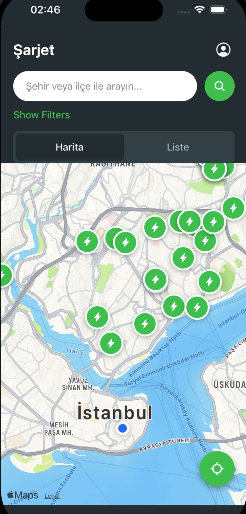
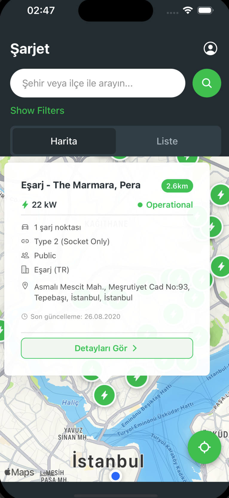
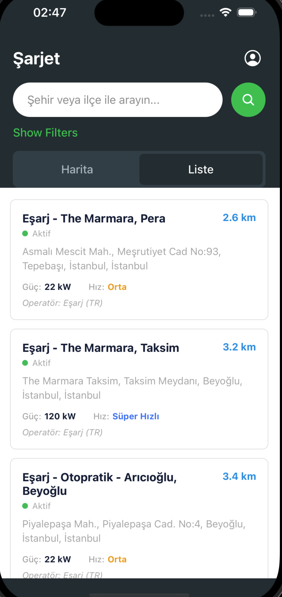
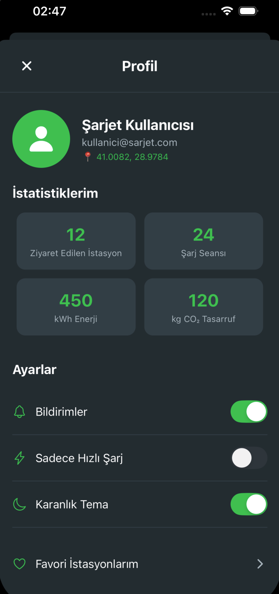

##  Uygulama Ekran Görüntüleri

### Ana Ekran - Harita Görünümü


*Ana ekranda harita görünümü, yakındaki şarj istasyonları ve filtreleme seçenekleri*

### İstasyon Detayları


*Seçilen istasyonun detaylı bilgileri: güç, konnektör tipi, operatör ve adres bilgileri*

### Liste Görünümü


*Yakındaki istasyonların liste halinde görünümü mesafe ve detay bilgileriyle*

### Profil ve Ayarlar


*Kullanıcı profili, istatistikler ve uygulama ayarları*


## Özellikler

### Temel Özellikler
- Yakındaki şarj istasyonlarını harita üzerinde gösterme
- Şarj istasyonu detaylarını görüntüleme
- Liste görünümü desteği
- Detaylı filtreleme seçenekleri (güç, mesafe, konnektör tipi, operatör, vb.)
- Gelişmiş filtreleme seçenekleri (fiyat, çalışma saatleri, puan, vb.)
- Arama fonksiyonu
- Koyu/açık tema desteği
- Kullanıcı profili ve istatistikler
- Rota planlama

### Yeni Geliştirilen Özellikler
- Performans optimizasyonları (marker render ve filtreleme)
- Geliştirilmiş arama fonksiyonu (çoklu alan araması)
- Detaylı filtre açıklamaları
- Tema değişikliğinde kullanıcı geri bildirimi
- Şarj istasyonu değerlendirme sistemi
- Kullanıcı şarj geçmişi
- Rota planlama (Google Maps API entegrasyonu planlandı)

## REPOYU CLONLE'LAMAK İCİN

```bash
git clone https://github.com/ysftsdln0/SarjEt
cd SarjEt
```

##  Kurulum ve Çalıştırma

### Gereksinimler
- Node.js (v16 veya üzeri)
- npm veya yarn
- Expo CLI
- PostgreSQL (backend için)
- iOS Simulator (iOS için) veya Android Emulator (Android için)

### Kurulum Adımları

1. **Repository'yi klonlayın:**
```bash
git clone https://github.com/ysftsdln0/SarjEt
cd SarjEt
```

2. **Environment dosyasını oluşturun:**
```bash
cp .env.example .env
# .env dosyasını düzenleyerek gerekli API key'leri ve URL'leri ayarlayın
```

3. **Frontend bağımlılıklarını yükleyin:**
```bash
npm install
```

4. **Backend bağımlılıklarını yükleyin:**
```bash
cd backend
npm install
cd ..
```

5. **Veritabanını kurun:**
```bash
cd backend
npx prisma migrate dev
npx prisma generate
cd ..
```

6. **Backend'i başlatın:**
```bash
cd backend
npm run dev
```

7. **Frontend'i başlatın (yeni terminal):**
```bash
npx expo start --dev-client
```

8. **Uygulamayı çalıştırın:**
   - iOS için: `i` tuşuna basın veya iOS Simulator'da açın
   - Android için: `a` tuşuna basın veya Android Emulator'da açın
## Environment

Use a single `.env` at the repo root to configure both frontend and backend. See `.env.example`.

Required keys:

- EXPO_PUBLIC_BACKEND_URL
- EXPO_PUBLIC_MAPBOX_ACCESS_TOKEN
- NODE_ENV, PORT, DATABASE_URL, JWT_SECRET, OPENCHARGE_MAP_API_KEY (backend)

## KULLANIM.md Yİ OKUYUN
