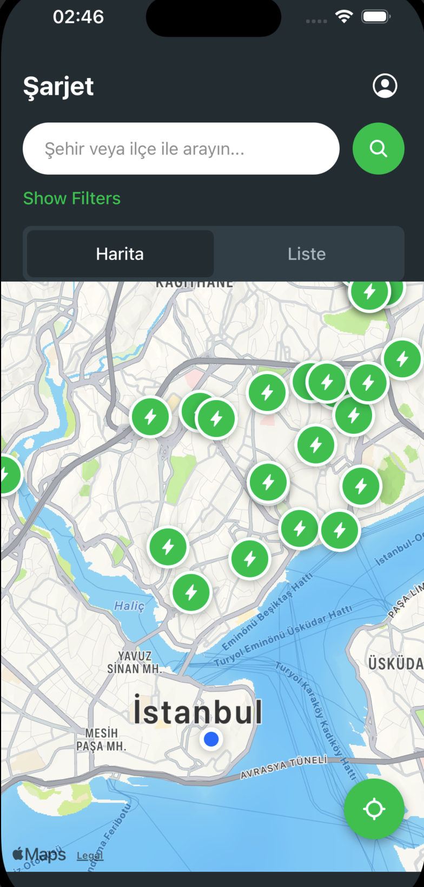
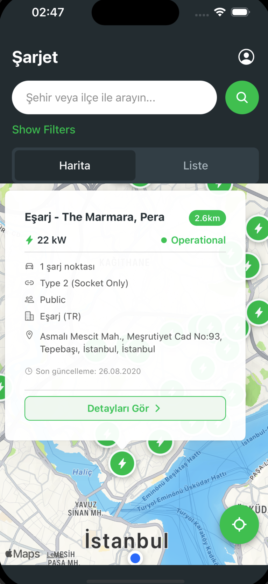
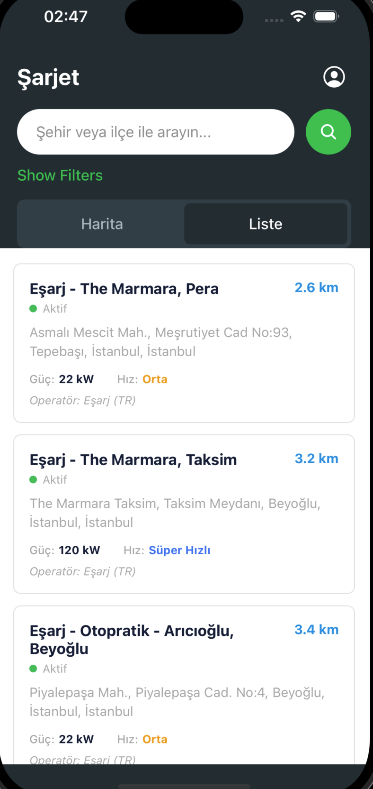

<div align="center">
  <h1>Voltify</h1>
  <p><strong>Versiyon 0.0.53</strong></p>
  <p><em>Akıllı Elektrikli Araç Şarj İstasyonu Bulucu</em></p>
  
  [](https://reactnative.dev/)
  [](https://expo.dev/)
  [](https://www.typescriptlang.org/)
  [](LICENSE)
</div>

---

## Voltify v0.0.53 ile Tanışın

**Voltify**, elektrikli araç sahiplerinin şarj istasyonlarını kolayca keşfetmelerine, navigasyon yapmalarına ve kullanmalarına yardımcı olmak için tasarlanmış kapsamlı bir mobil uygulamadır. React Native ile geliştirilmiş ve gerçek zamanlı verilerle desteklenen Voltify, yolculuğunuz için mükemmel şarj noktasını bulmanız için sezgisel bir arayüz sunar.

### 0.0.53 Sürümündeki Yenilikler

- **Gelişmiş Performans**: Optimize edilmiş işaretleyici render ve filtreleme algoritmaları
- **Gelişmiş Arama**: Akıllı eşleştirme ile çoklu alan arama fonksiyonu
- **Akıllı Filtreler**: Güç değerleri, konnektör tipleri, operatörler ve daha fazlasıyla detaylı filtreleme
- **Değerlendirme Sistemi**: Topluluk odaklı istasyon incelemeleri ve puanları
- **Şarj Geçmişi**: Şarj oturumlarınızı takip edin ve kalıpları analiz edin
- **Rota Planlama**: Sorunsuz yolculuk planlaması için entegre navigasyon desteği
- **İyileştirilmiş UX**: Kullanıcı geri bildirimleri ve yumuşak animasyonlarla daha iyi tema değiştirme

---

## Temel Özellikler

### **İstasyon Keşfi**
- **Etkileşimli Harita Görünümü**: Yakındaki şarj istasyonlarının gerçek zamanlı görselleştirmesi
- **Kümeleme Desteği**: Daha iyi harita performansı için istasyonların akıllı gruplandırması
- **Liste Görünümü**: Mesafeye dayalı sıralama ile alternatif görünüm
- **Detaylı Bilgi**: Güç değerleri, konnektör tipleri, fiyatlandırma ve kullanılabilirlik

### **Gelişmiş Filtreleme**
- **Güç Aralığı**: Şarj kapasitesine göre filtreleme (kW)
- **Mesafe**: Maksimum arama yarıçapını ayarlama
- **Konnektör Tipleri**: CCS, CHAdeMO, Type 2 ve daha fazlası
- **Operatörler**: Belirli şarj ağı sağlayıcılarına göre filtreleme
- **Fiyat Aralığı**: Bütçenize uygun istasyonları bulma
- **Çalışma Saatleri**: 7/24 istasyonlar veya belirli zaman dilimleri
- **Olanaklar**: WiFi, park yeri, restoranlar ve daha fazlası

### **Kullanıcı Deneyimi**
- **Koyu/Açık Temalar**: Her ortam için uyarlanabilir arayüz
- **Erişilebilirlik**: Daha iyi erişilebilirlik için azaltılmış hareket desteği
- **Çoklu Dil**: Birden fazla dil desteği (şu anda Türkçe/İngilizce)
- **Çevrimdışı Destek**: Sınırlı bağlantı senaryoları için önbelleğe alınmış veriler

### **Kullanıcı Profili ve İstatistikler**
- **Kişisel Kontrol Paneli**: Şarj aktivitelerinizi takip edin
- **Favoriler**: Sık ziyaret ettiğiniz istasyonları kaydedin
- **Geçmiş**: Geçmiş şarj oturumlarını inceleyin
- **İstatistikler**: Şarj kalıplarınızı ve maliyetlerinizi analiz edin

### **Navigasyon ve Rota Planlama**
- **Adım Adım Yönlendirme**: Yerel harita uygulamalarıyla entegre
- **Çok Duraklı Planlama**: Birden fazla şarj durakları ile rota planlama
- **Gerçek Zamanlı Trafik**: Mevcut koşullara göre güncellenmiş rota önerileri

---

## Ekran Görüntüleri

<div align="center">
  
  
  
</div>

<div align="center">
  <em>Harita Görünümü • İstasyon Detayları • Liste Görünümü</em>
</div>

---

## Teknoloji Yığını

### Frontend
- **React Native** Expo managed workflow ile
- **TypeScript** tip güvenliği için
- **Mapbox GL** gelişmiş haritalama için
- **React Navigation** yönlendirme için
- **AsyncStorage** yerel kalıcılık için

### Backend
- **Node.js** Express ile
- **PostgreSQL** veritabanı
- **Prisma ORM** veritabanı yönetimi için
- **OpenChargeMap API** entegrasyonu
- **JWT** kimlik doğrulama

### DevOps
- **Docker** konteynerizasyon için
- **PM2** süreç yönetimi için
- **ESLint** & **Prettier** kod kalitesi için

---

## Hızlı Başlangıç

### Gereksinimler
- Node.js 16+ 
- npm veya yarn
- Expo CLI
- PostgreSQL
- iOS Simulator veya Android Emulator

### Kurulum

1. **Repository'yi klonlayın**
```bash
git clone https://github.com/ysftsdln0/SarjEt
cd SarjEt
```

2. **Bağımlılıkları yükleyin**
```bash
# Frontend bağımlılıklarını yükleyin
npm install

# Backend bağımlılıklarını yükleyin
cd backend
npm install
cd ..
```

3. **Environment yapılandırması**
```bash
cp .env.example .env
# .env dosyasını API anahtarlarınız ve yapılandırmanızla düzenleyin
```

**Gerekli environment değişkenleri:**
- `EXPO_PUBLIC_BACKEND_URL` - Backend API endpoint
- `EXPO_PUBLIC_MAPBOX_ACCESS_TOKEN` - Mapbox API anahtarı
- `DATABASE_URL` - PostgreSQL bağlantı dizesi
- `JWT_SECRET` - Kimlik doğrulama gizli anahtarı
- `OPENCHARGE_MAP_API_KEY` - Şarj istasyonu veri API anahtarı

4. **Veritabanını kurun**
```bash
cd backend
npx prisma migrate dev
npx prisma generate
npx prisma db seed  # Opsiyonel: örnek verilerle doldur
cd ..
```

5. **Backend'i başlatın**
```bash
cd backend
npm run dev
```

6. **Frontend'i başlatın** (yeni terminal)
```bash
npx expo start --dev-client
```

7. **Uygulamayı çalıştırın**
- **iOS**: `i` tuşuna basın veya iOS Simulator'da açın
- **Android**: `a` tuşuna basın veya Android Emulator'da açın
- **Web**: Web tarayıcısı için `w` tuşuna basın (sınırlı özellikler)

---

## Proje Yapısı

```
voltify/
├── src/
│   ├── components/      # Yeniden kullanılabilir UI bileşenleri
│   ├── screens/         # Ekran bileşenleri
│   ├── navigation/      # Navigasyon yapılandırması
│   ├── services/        # API ve iş mantığı
│   ├── hooks/           # Özel React hook'ları
│   ├── contexts/        # React Context sağlayıcıları
│   ├── utils/           # Yardımcı fonksiyonlar
│   ├── types/           # TypeScript tanımlamaları
│   └── constants/       # Uygulama sabitleri
├── backend/
│   ├── src/
│   │   ├── controllers/ # İstek işleyiciler
│   │   ├── services/    # İş mantığı
│   │   ├── routes/      # API rotaları
│   │   ├── middleware/  # Express middleware
│   │   └── utils/       # Yardımcı fonksiyonlar
│   ├── prisma/          # Veritabanı şeması ve migrasyonlar
│   └── docker/          # Docker yapılandırması
├── assets/              # Resimler, fontlar, vb.
└── __tests__/          # Test dosyaları
```

---

## Test

```bash
# Tüm testleri çalıştır
npm test

# İzleme modunda testleri çalıştır
npm run test:watch

# Kapsam raporu oluştur
npm run test:coverage
```

---

## Dokümantasyon

- [Kullanım Kılavuzu](KULLANIM.md) - Detaylı kullanım talimatları
- [Environment Kurulumu](ENV_SETUP_GUIDE.md) - Environment yapılandırma kılavuzu
- [Docker Kurulumu](DOCKER_CONNECTION_GUIDE.md) - Docker deployment kılavuzu
- [Backend Dokümantasyonu](backend/README.md) - Backend API dokümantasyonu
- [UI Bileşenleri](SARJET_UI_README.md) - UI bileşen kütüphanesi

---

## Katkıda Bulunma

Katkılarınızı memnuniyetle karşılıyoruz! Lütfen şu adımları izleyin:

1. Repository'yi fork edin
2. Özellik dalı oluşturun (`git checkout -b feature/harika-ozellik`)
3. Değişikliklerinizi commit edin (`git commit -m 'Harika özellik eklendi'`)
4. Dalı push edin (`git push origin feature/harika-ozellik`)
5. Pull Request açın

Lütfen kodunuzun kodlama standartlarımıza uygun olduğundan ve uygun testleri içerdiğinden emin olun.

---

## Lisans

Bu proje MIT Lisansı altında lisanslanmıştır - detaylar için [LICENSE](LICENSE) dosyasına bakın.

---

## Teşekkürler

- Şarj istasyonu verileri için **OpenChargeMap**
- Haritalama teknolojisi için **Mapbox**
- Harika geliştirme platformu için **Expo** ekibi
- Voltify'ın tüm katkıda bulunanları ve kullanıcıları

---

## İletişim ve Destek

- **Sorunlar**: [GitHub Issues](https://github.com/ysftsdln0/SarjEt/issues)
- **Tartışmalar**: [GitHub Discussions](https://github.com/ysftsdln0/SarjEt/discussions)
- **E-posta**: support@voltify.app

---

<div align="center">
  <p>Voltify Ekibi tarafından yapılmıştır</p>
  <p>
    <a href="#voltify-v0053-ile-tanışın">Başa Dön</a>
  </p>
</div>
